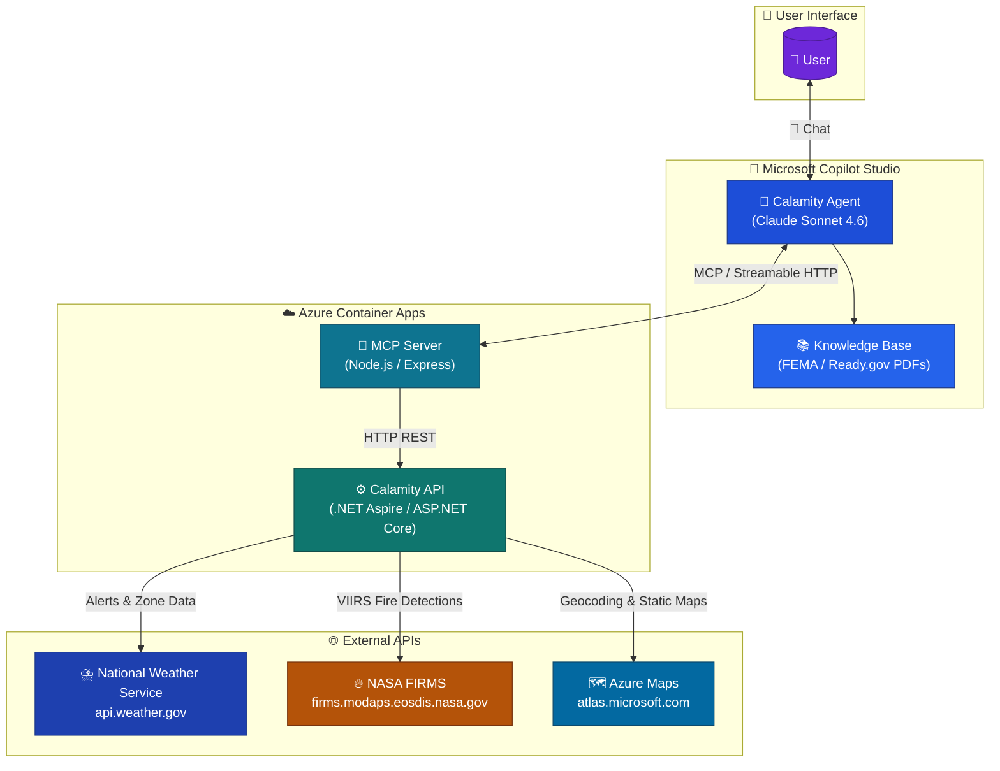
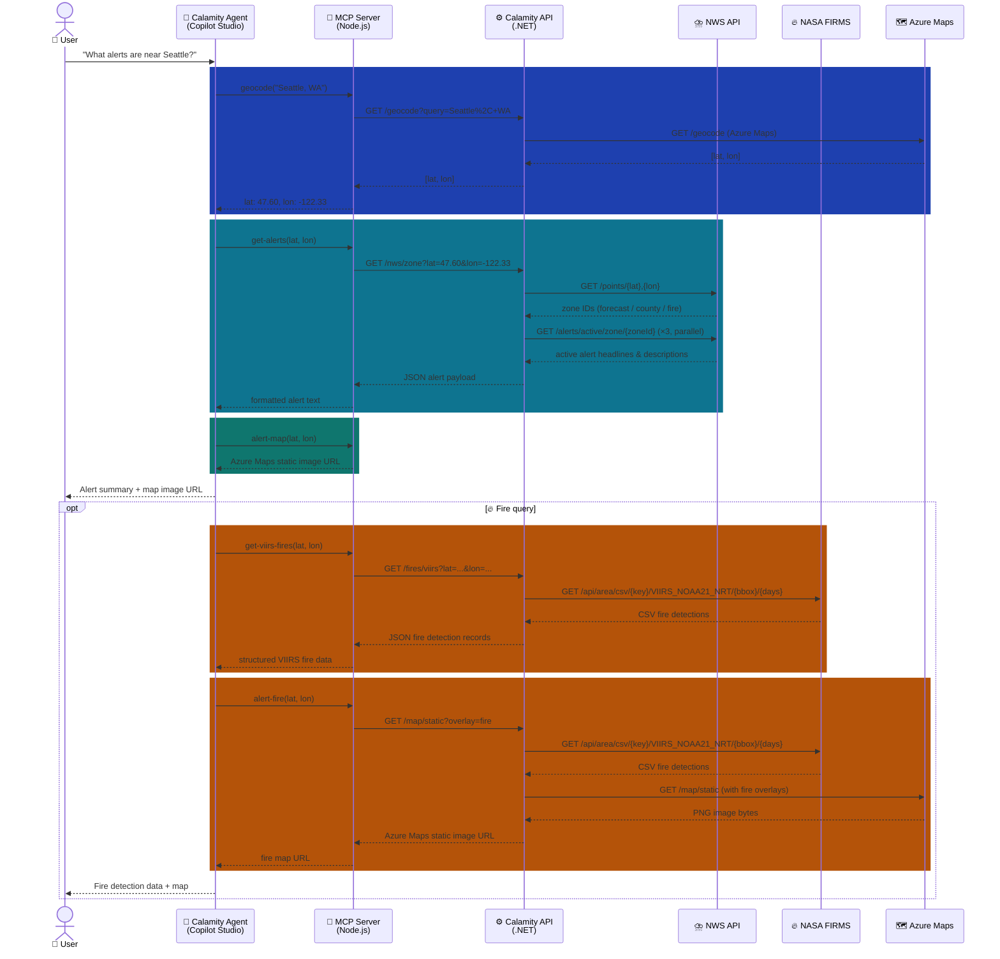

# Architecture

## System Architecture



---

## Data Flow



---

## Technologies by Project

### `⚙️ /CalamityCopilotService.Api` — Aspire Web API

- 🔷 **.NET 10** / ASP.NET Core Minimal APIs
- 🚀 **.NET Aspire** — service defaults, OpenTelemetry, health checks
- 📄 **Microsoft.AspNetCore.OpenApi** — OpenAPI / Swagger
- 🗺️ **Azure Maps** — geocoding and static map image rendering
- ⛈️ **National Weather Service REST API** — zone lookups, active alert queries
- 🔥 **NASA FIRMS VIIRS NOAA-21 NRT API** — near real-time fire detection data (CSV)
- 📐 Ramer-Douglas-Peucker polygon simplification (built-in) for NWS zone rendering

### `🚀 /CalamityCopilotService.AppHost` — Aspire App Host

- 🔷 **.NET 10** / .NET Aspire hosting model
- 🎛️ Orchestrates local development and Azure deployment of the API project
- ☁️ **Azure Developer CLI (`azd`)** — cloud provisioning and container deployment

### `🔌 /MCP` — MCP Server

- 🟢 **Node.js** / 🔷 **TypeScript**
- ⚡ **Express 5** — HTTP server
- 🤝 **`@modelcontextprotocol/sdk`** — MCP Streamable HTTP transport
- ✅ **Zod** — input schema validation for MCP tools
- 🛠️ Exposes five tools to Copilot Studio: `geocode`, `get-alerts`, `alert-map`, `alert-fire`, `get-viirs-fires`
- ☁️ Deployed as an **Azure Container App**

### `🤖 /CopilotStudio/Calamity Agent` — Copilot Studio Agent

- 🏗️ **Microsoft Copilot Studio** — declarative YAML / `.mcs.yml` format
- 🧠 **Claude Sonnet 4.6** — underlying generative model
- 🔌 **MCP connector** (`ca_CalamityMCP2`) — connects the agent to the MCP Server via Streamable HTTP
- 📚 **Knowledge base** — FEMA and Ready.gov preparedness PDFs for grounding responses
- 💬 Topics: greeting, current conditions, conversation lifecycle, fallback handling
- 📍 Variables: `UserLocation`, `location` for session state

---

## Prerequisites

| Tool | Purpose | Min Version |
|------|---------|-------------|
| 🔷 [.NET SDK](https://dotnet.microsoft.com/download) | Build and run the Aspire API | 10.0 |
| 🟢 [Node.js](https://nodejs.org/) | Build and run the MCP server | 22 LTS |
| 🐳 [Docker Desktop](https://www.docker.com/products/docker-desktop/) | Container runtime for Aspire local dev | latest |
| ☁️ [Azure Developer CLI (`azd`)](https://learn.microsoft.com/azure/developer/azure-developer-cli/install-azd) | Provision and deploy to Azure Container Apps | 1.x |
| 🔑 [Azure subscription](https://azure.microsoft.com/free/) | Host the container apps and Azure Maps | — |
| 🗺️ [Azure Maps account](https://learn.microsoft.com/azure/azure-maps/quick-demo-map-app) | Geocoding and static map rendering | — |
| 🔥 [NASA FIRMS API key](https://firms.modaps.eosdis.nasa.gov/api/area/) | VIIRS fire detection data | — |
| 🤖 [Microsoft Copilot Studio license](https://www.microsoft.com/microsoft-copilot/microsoft-copilot-studio) | Deploy and run the Calamity Agent | — |
| 🪣 [Azure Blob Storage account](https://learn.microsoft.com/azure/storage/blobs/storage-blobs-introduction) | *(Optional)* Host static map image assets served to the agent | — |

---

## Setup

### 1. 🔷 Calamity API

Configure secrets for Azure Maps and NASA FIRMS. The recommended approach is .NET user secrets so keys are never committed:

```powershell
cd CalamityCopilotService.Api
dotnet user-secrets set "AzureMaps:Key" "<your-azure-maps-key>"
dotnet user-secrets set "NasaFirms:ApiKey" "<your-nasa-firms-key>"
```

Run locally via .NET Aspire (launches the API + Aspire dashboard):

```powershell
cd CalamityCopilotService.AppHost
dotnet run
```

The Aspire dashboard opens at `https://localhost:17191`. The API is available at the URL shown in the dashboard for the `calamitycopilotservice-api` resource.

### 2. 🔌 MCP Server

Install dependencies and build:

```powershell
cd MCP
npm install
npm run build
```

Create a `.env` file in `MCP/` with the URL of your running API (local or deployed):

```dotenv
CALAMITY_API_BASE_URL=http://localhost:<port-from-aspire-dashboard>
```

Start the server:

```powershell
npm start
```

The MCP server listens on `http://localhost:3000/mcp` by default. Set the `PORT` environment variable to override.

### 3. ☁️ Deploy to Azure

Both the API and MCP server are deployed as Azure Container Apps using the Azure Developer CLI from the repository root:

```powershell
azd auth login
azd up
```

`azd up` provisions all Azure resources defined in `azure.yaml` (resource group, container registry, container apps) and deploys both services. After deployment, update `MCP/.env` with the deployed API URL shown in the `azd up` output, then redeploy the MCP server.

### 4. 🤖 Configure the Copilot Studio Agent

1. Open [Copilot Studio](https://copilotstudio.microsoft.com) and import the solution from `CopilotStudio/Calamity Agent/`.
2. Open the **CalamityMCP2** connector and update the MCP server URL to point to your deployed Azure Container App endpoint.
3. Publish the agent.
