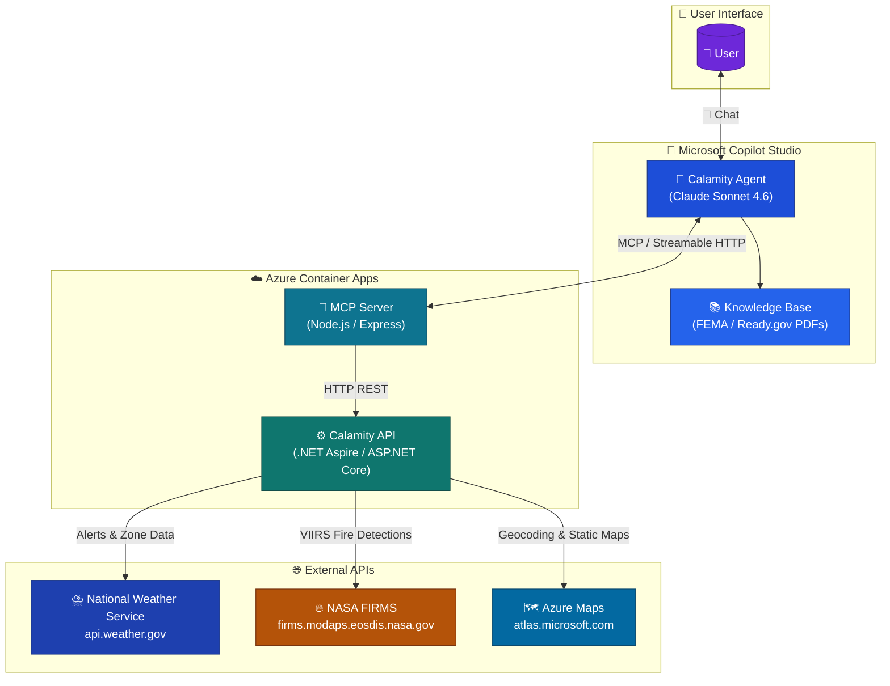
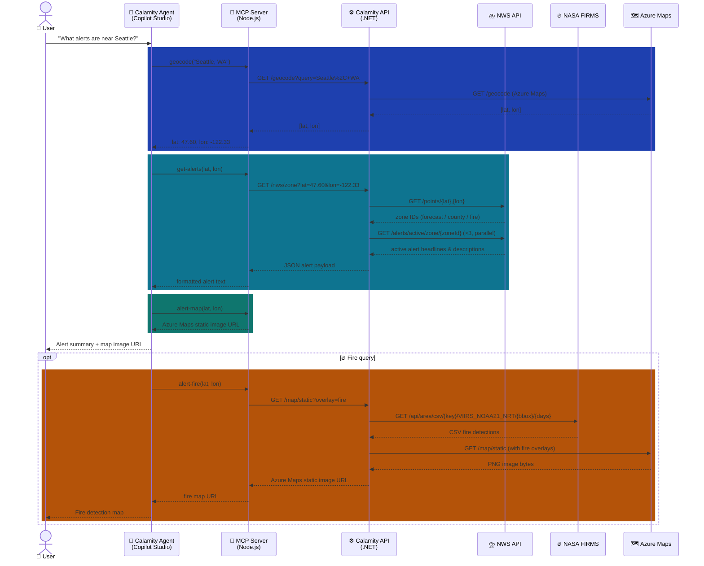

[](https://microsoft.github.io/agent-academy/events/hackathon)

# Agent Academy Hackathon: Calamity Agent Weather & Fire Alerts

## Project Goal
> *Disasters disrupt thousands of lives every year, leaving behind lasting effects on people and property...*
> *You and your family can take simple steps now to prepare for emergencies. By doing so, you **take back control**—even in the uncertainty of disaster.*

Source: FEMA. *[Are You Ready? An In-Depth Guide to Citizen Preparedness](https://www.ready.gov/sites/default/files/2021-11/are-you-ready-guide.pdf)*, Publication P-2064, September 2020

June 1 is the start of the Atlantic hurricane season, but there are many different types of disasters and hazards. Our risk of becoming affected depends on the possibility of these events and our vulnerability to them.

One way of reducing our exposure to risk is access to up-to-date information. Using [Microsoft Copilot Studio](https://www.microsoft.com/en-us/microsoft-365-copilot/microsoft-copilot-studio/), I developed **Calamity Agent** to:
* ☁️ Get current [National Weather Service](https://www.weather.gov/documentation/services-web-api) alerts based on a person's location
* 🔥 Provide near-real time fire hazards via NASA's [Fire Information for Resource Management System (FIRMS)](https://firms.modaps.eosdis.nasa.gov/)
* 🗺️ Show maps of the hazardous areas
* ℹ️ Recommend useful disaster preparedness information based on all of the above

## Author
Andy Merhaut (GitHub: [@tagr](https://github.com/tagr))

## Samples


*Figure 1. Adaptive card prompts for user location*


*Figure 2. Current NWS flash flood warnings for the selected location*


*Figure 3. Inline map of the hazardous area*


*Figure 4. Full-size map. Geometry provided by NWS, map generated by [Azure Maps](https://azure.microsoft.com/en-us/products/azure-maps/)*


*Figure 5. Fire hazard from VIIRS NOAA-21 data*


## System Architecture




---

## Data Flow



---

## Technologies by Project

### `⚙️ /CalamityCopilotService.Api` — Aspire Web API

- 🔷 **.NET 10** / ASP.NET Core Minimal APIs
- 🚀 **.NET Aspire** — service defaults, OpenTelemetry, health checks
- 📄 **Microsoft.AspNetCore.OpenApi** — OpenAPI / Swagger
- 🗺️ **Azure Maps** — geocoding and static map image rendering
- ⛈️ **National Weather Service REST API** — zone lookups, active alert queries
- 🔥 **NASA FIRMS VIIRS NOAA-21 NRT API** — near real-time fire detection data (CSV)
- 📐 Ramer-Douglas-Peucker polygon simplification (built-in) for NWS zone rendering

### `🚀 /CalamityCopilotService.AppHost` — Aspire App Host

- 🔷 **.NET 10** / .NET Aspire hosting model
- 🎛️ Orchestrates local development and Azure deployment of the API project
- ☁️ **Azure Developer CLI (`azd`)** — cloud provisioning and container deployment

### `🔌 /MCP` — MCP Server

- 🟢 **Node.js** / 🔷 **TypeScript**
- ⚡ **Express 5** — HTTP server
- 🤝 **`@modelcontextprotocol/sdk`** — MCP Streamable HTTP transport
- ✅ **Zod** — input schema validation for MCP tools
- 🛠️ Exposes four tools to Copilot Studio: `geocode`, `get-alerts`, `alert-map`, `alert-fire`
- ☁️ Deployed as an **Azure Container App**

### `🤖 /CopilotStudio/Calamity Agent` — Copilot Studio Agent

- 🏗️ **Microsoft Copilot Studio** — declarative YAML / `.mcs.yml` format
- 🧠 **Claude Sonnet 4.6** — underlying generative model
- 🔌 **MCP connector** (`ca_CalamityMCP2`) — connects the agent to the MCP Server via Streamable HTTP
- 📚 **Knowledge base** — FEMA and Ready.gov preparedness PDFs for grounding responses
- 💬 Topics: greeting, current conditions, conversation lifecycle, fallback handling
- 📍 Variables: `UserLocation`, `location` for session state
---

## Prerequisites

| Tool | Purpose | Min Version |
|------|---------|-------------|
| 🔷 [.NET SDK](https://dotnet.microsoft.com/download) | Build and run the Aspire API | 10.0 |
| 🟢 [Node.js](https://nodejs.org/) | Build and run the MCP server | 22 LTS |
| 🐳 [Docker Desktop](https://www.docker.com/products/docker-desktop/) | Container runtime for Aspire local dev | latest |
| ☁️ [Azure Developer CLI (`azd`)](https://learn.microsoft.com/azure/developer/azure-developer-cli/install-azd) | Provision and deploy to Azure Container Apps | 1.x |
| 🔑 [Azure subscription](https://azure.microsoft.com/free/) | Host the container apps and Azure Maps | — |
| 🗺️ [Azure Maps account](https://learn.microsoft.com/azure/azure-maps/quick-demo-map-app) | Geocoding and static map rendering | — |
| 🔥 [NASA FIRMS API key](https://firms.modaps.eosdis.nasa.gov/api/area/) | VIIRS fire detection data | — |
| 🤖 [Microsoft Copilot Studio license](https://www.microsoft.com/microsoft-copilot/microsoft-copilot-studio) | Deploy and run the Calamity Agent | — |
| 🪣 [Azure Blob Storage account](https://learn.microsoft.com/azure/storage/blobs/storage-blobs-introduction) | *(Optional)* Host static map image assets served to the agent | — |

---

## Setup

### 1. 🔷 Calamity API

Configure secrets for Azure Maps and NASA FIRMS. The recommended approach is .NET user secrets so keys are never committed:

```powershell
cd CalamityCopilotService.Api
dotnet user-secrets set "AzureMaps:Key" "<your-azure-maps-key>"
dotnet user-secrets set "NasaFirms:ApiKey" "<your-nasa-firms-key>"
```

Run locally via .NET Aspire (launches the API + Aspire dashboard):

```powershell
cd CalamityCopilotService.AppHost
dotnet run
```

The Aspire dashboard opens at `https://localhost:17191`. The API is available at the URL shown in the dashboard for the `calamitycopilotservice-api` resource.

### 2. 🔌 MCP Server

Install dependencies and build:

```powershell
cd MCP
npm install
npm run build
```

Create a `.env` file in `MCP/` with the URL of your running API (local or deployed):

```dotenv
CALAMITY_API_BASE_URL=http://localhost:<port-from-aspire-dashboard>
```

Start the server:

```powershell
npm start
```

The MCP server listens on `http://localhost:3000/mcp` by default. Set the `PORT` environment variable to override.

### 3. ☁️ Deploy to Azure

Both the API and MCP server are deployed as Azure Container Apps using the Azure Developer CLI from the repository root:

```powershell
azd auth login
azd up
```

`azd up` provisions all Azure resources defined in `azure.yaml` (resource group, container registry, container apps) and deploys both services. After deployment, update `MCP/.env` with the deployed API URL shown in the `azd up` output, then redeploy the MCP server.

### 4. 🤖 Configure the Copilot Studio Agent

1. Open [Copilot Studio](https://copilotstudio.microsoft.com) and import the solution from `CopilotStudio/Calamity Agent/`.
2. Open the **CalamityMCP2** connector and update the MCP server URL to point to your deployed Azure Container App endpoint.
3. Publish the agent.

## Acknowledgements
* ♥️ My family
* ♥️ My friends
* 📺 Elaiza Benitez's Copilot Studio Agent Academy series, especially [Mission 08. Enhance user interactions in topics with Adaptive Cards](https://www.youtube.com/watch?v=RhIlzYHPCXo) to level up my agent UI
